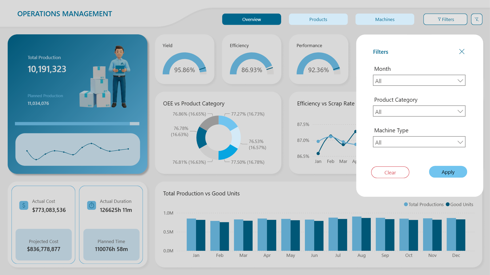

# Manufacturing Overview Dashboards Power BI (Advanced)
Welcome to the Manufacturing Overview Dashboard Project 🚀  
This project is focused on creating an advanced Power BI Dashboard consisting of multiple pages for a manufacturing company specialized in production and distribution of goods across multiple industries.

The Project is intended as a study to understand the elements that goes into creating a complex BI dashboard. The data used in this project was generated to reflect real world manufacturing data as closely as possible by including variability, meaning it includes random defects and delays across production stages.

#### Final [Interactive Dashboard]() in Power BI Service

## 📌 Project Overview
Create an advanced Power BI Dashboard for a manufacturing company by tracking the production processes for a fiscal year. The source data consist of production details for both the goods produced and the equipments involved in the production. The dashboard should be able to capture all the relevant details regarding both production and equipments. A larger overview of the manufacturing process including important details regarding both products and equipments as the main page and dedicated pages for products and equipments for in depth analysis should be present.

The project should follow the standard four stage process of
- **Data Cleaning and Standardization**
- **Data Modelling**
- **DAX Calculations**
- **Data Visualization**

Being able to derive business insight and analytical decision for Stakeholders and Analyst is the primary goal of creating such a dashboard therefore the end product should be a clean and modern looking dashboard that follows in all the UI/UX principles for user friendly interaction.

---

## 📊 Dashboards

### **Main Page**

### **Products Page**

### **Machines Page**

### Filter Pane

---

## 💡Project Outline
The Project is focused on creating a simple and interactive dashboard for an manufacturing unit to track the production details for a fiscal year. The standard approach is to go through the four step process of Cleaning, Modelling, Calculating and Visualizing.

The data source for this project consist of three tables, one fact table detailing the production details called `fact_production` and two other dimension table each with details concerning the products and equipments, `dim_products` and `dim_equipments` respectively. This tables form a **Star Schema** pattern with the centre fact table and the surrounding dimension tables. Additionally two other tabes should be formed, one to calculate the necessary measures and one as a dedicated date table. All the tables should be adequate to provide the necessary details for a clean and modern looking dashboard that is both easy to use and contains all the insights that might be useful to take business decisions

### Data Cleaning and Standardization ⚙️
The source data file consist of three main tables

Production Fact table - [`fact_production`](dataset/fact_production.csv)  
Products Dimension table - [`dim_products`](dataset/dim_products.csv)  
Equipments Dimension table - [`dim_equipments`](dataset/dim_equipments.csv)

Each table consists of multiple columns that are both dimensional values and measure values. Each columns should be analyzed to ensure that they follow the standard data conventions

- Remove any null values in the primary key columns
- Remove all the leading and trailing spaces in the character columns
- Ensure the values in the date column are of date format
- Check the range of date column to ensure only values from a specific year
- Check the sanity of categorical columns
- Check the numerical columns for any other values
- Assign the correct data type to each column

After the data cleaning process the end data is clean normalized and standardized to move on to the modelling stage

### Data Modelling 🔗
All the tables in the source dataset follows the standard convention of one fact table and multiple dimension tables, thus the right approach when it comes to modelling the relationship between the data is to establish a **Star Schema** pattern between the tables. The fact fact table would be placed on the centre and all the dimension tables surround them as to provide additional information for the central table. Each dimension table in the dataset consist of a Primary key, uniquely identifying each distinct element in the dimension table, these primary key appear multiple times inside the fact table to reference a element, in this case a specific product or an equipment. Thus these keys are used to form a one to many relation between the dimension and fact table.

[data_model](docs.data_model.png)

### DAX Calculations 📐
The existing tables can only provide limited details when it comes to creating KPIs and other relevant metrics. Using Data Analytics Expressions (DAX) two other tables are created to make the visualization process easy and straight forward

The **Measures** table `measures_` includes relevant calculation that has been derived from the existing measure values

- Aggregated Values
  - `total_produced` - Sum of all the units produced
  - `total_cost` - Sum of all the cost for the production of each unit
  - `total_defective` - Sum of all the units that are defective
  - `units_good` - Total defective units subtracted from total produced units
  - `waste_cost` - Sum of all the cost by defective units
  - `unit_cost` - Waste cost subtracted from the total cost
  - `total_planned_units` - Sum of all the planned units
  - `projected_cost` - Sum of all the cost for the production of each planned unit
  - `production_to_target` - Total produced subtracted from total planned unit

- Percentage Values
  - `yield%` - The percentage of good units among the total produced
  - `efficiency%` - The percentage of planned duration compared to actual duration
  - `performance%` - The percentage of total production to  planned production
  - `oee` - Overall Equipment Effectiveness (Multiplying Yield, Efficiency and Performance)
  - `scrap_rate` - The percentage of defective units to total production
  - `production_value` - The percentage of increase or decrease in total production

- Time Series Values
  - `total_actual_duration` - Sum of the production duration for each unit
  - `total_planned_duration` - Sum of the duration for each planned units
  - `down_time_variance` - Planned duration subtracted from actual duration
 
- Formatted Values
  - `total_time` - Actual duration formatted in hours and minutes
  - `planned_time` - Planned duration formatted in hours and minutes
  - `downtime_variance_time` - Downtime Variance formatted in hours and minutes

All the formulas are provided as a single DAX formula in [`measures_dax_formula`](scripts/measures_dax_formula.txt)

The **Date** table is an expanded view of all the dates from production year

The date table is calculated with the DAX formula [`date_dax_formula`](scripts/date_dax_formula.txt)

### Data Visualization 📊
There are a total of three dashboards in this project. The main page consists of all the necessary details for a overview of the entire production, the products and machines page gives in depth analytical details about the subject matter.

Color Palette - Primary `00668c`, Secondary `71c4ef`, Tertiary `d4eaf7`
Typography - `Segoe UI`

- **Main Page**

  

  There are six different types of visuals in the main page, each detailing different aspect of the manufacturing process
  - Main KPI Card - Total Production compared with Planned Production, Bar chart comparing the depicted values and a Line chart for monthly breakdown of production
  - Secondary KPI Cards - The Actual cost compared with the projected cost and Actual duration compared with Planned duration
  - Gauge KPIs - Percentage values of the equipment metrics compared with the target values
  - Donut Chart - Overall Equipment Effectiveness across various products categories
  - Line Chart - Efficiency versus Scrap rate to understand whether rushing production is causing more mistakes
  - Clustered Column Chart - Total production and Good units produced each month

- **Product Page**

  

  There are five different types of visuals in the product page including the KPI card, which is consistent across all pages
  - Secondary KPI Cards - Good Units compared with Defective Units and Unit cost compared with waste cost
  - Bar Chart - The amount of unique product present in each category
  - Donut Charts - Breakdown of all the important products metrics by category
  - Matrix - Detailed breakdown of all the metrics with drill down functionality for the products category
 
- **Machines Page**

  

  There are also five different types of visual in the machines pages including the main KPI card
  - Secondary KPI Cards - A card view of all the equipment values presented in the main page along with Downtime Variance
  - Clustered Bar Chart - Downtime variance by machine type grouped together according to maintenance status, shows the least performing machine type and its current maintenance status
  - Treemap - Defective units versus machine type, shows where the quality issue is concentrated
  - Matrix - Detailed breakdown of all the metrics with drill down functionality for the machine type
 
- **Filter Pane**

  

  There two buttons provided to control the filters, a 'Filters' button to access the filter pane and a 'Reset filters' button to clear all the filters. Inside the filters pane one can filter the whole page according to month, product category or products_id within and machine type with machine_id within. There are also two button in the filter pane one to apply all the filter and one to clear them.

All the visuals follows UI/UX principles, the provide all the necessary details regarding all the components regarding the manufacturing process

---

## 🪛 Conclusion
This project is a study on how to create an advanced Power BI dashboard with multiple pages and complex calculations. Following all the industry practices for a modern and clean looking visuals while providing all the necessary business insights with a clean and easy to use interface.

Thank You visiting the Power BI Manufacturing Dashboard 📌

---

